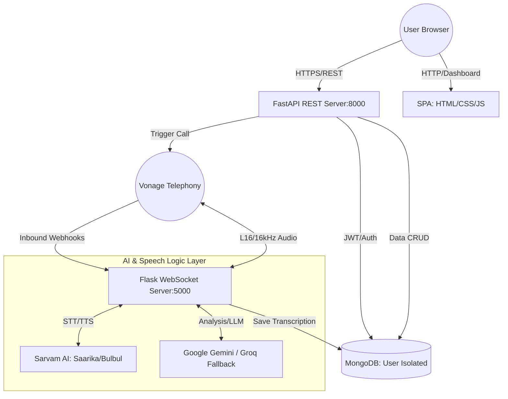
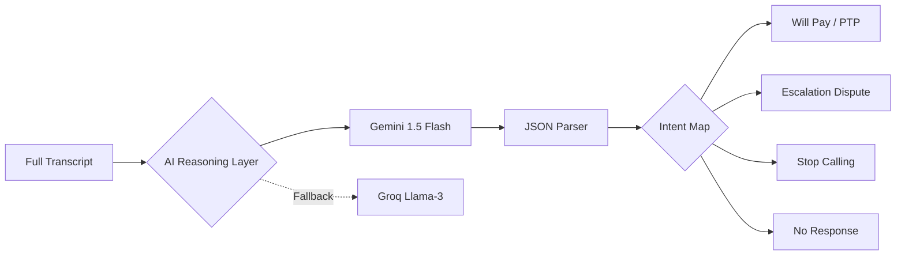
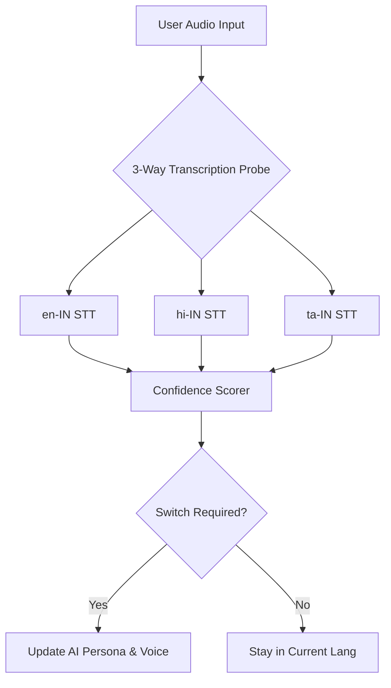

# Technical Documentation: AIaaS Finance Platform (v1.2)

## 1. System Architecture Overview

The AIaaS Finance Platform is built on a **Decoupled Monolith** architecture with a specialized **Dual-Backend** strategy to handle high-performance REST APIs and real-time audio streams separately.

### High-level Architecture Diagram

### Component Interaction Flow
1.  **Frontend Dashboard**: The user uploads CSV data and manages borrower accounts.
2.  **FastAPI (REST)**: Handles heavy-duty tasks like data ingestion (Pandas), User Authentication (JWT), and Bulk Call Triggering.
3.  **Flask (WebSockets)**: Dedicated to the real-time "hot-path" of the telephony audio. It bridges Vonage's raw audio stream to AI transcription and synthesis.
4.  **Database (MongoDB)**: Enforces **User Isolation**, ensuring each agency only sees its own data via `user_id` filtering on all queries.

---

## 2. Intent & Multilingual Architecture

### Intent Detection Architecture
The system employs a "Dual-Phase" intent engine. While the conversation is fluid, the formal classification happens post-call to ensure 100% accuracy based on the full context.

### Multilingual Architecture
The platform is designed for the linguistic diversity of the Indian market, supporting English, Hindi, and Tamil with dynamic "auto-switching".

---

## 3. Data Layer

### Data Schema (MongoDB Collections)

#### 1. Users Collection
Stores agency account information and authentication state.
| Field | Type | Description |
| :--- | :--- | :--- |
| `_id` | ObjectId | Unique User ID |
| `username` | String | Unique login name |
| `password` | String | Hashed password |
| `access_token` | String | Active JWT session token |
| `refresh_token`| String | Token for session renewal |
| `created_at` | DateTime | Account creation timestamp |

#### 2. Borrowers Collection
The primary collection for lead management and call status.
| Field | Type | Description |
| :--- | :--- | :--- |
| `user_id` | String | Owner ID (Enforces Isolation) |
| `NO` | String | Unique Borrower/Loan identifier |
| `BORROWER` | String | Name of the borrower |
| `AMOUNT` | Float | Total arrears amount |
| `MOBILE` | String | Verified phone number |
| `Payment_Category`| String | Consistent / Inconsistent / Overdue |
| `call_completed` | Boolean | True if AI finished the call |
| `ai_summary` | String | Gemini-generated call overview |
| `payment_confirmation` | String | Intent result (e.g., "Will Pay on 20th") |
| `follow_up_date`| String | Automatically calculated next call date |

#### 3. Call Sessions Collection
Archive of all historical interactions for audit and analysis.
| Field | Type | Description |
| :--- | :--- | :--- |
| `user_id` | String | Owner ID |
| `call_uuid` | String | Vonage unique tracking ID |
| `loan_no` | String | Reference to Borrower |
| `transcript` | Array | Time-stamped dialog history |
| `ai_analysis` | Object | Full JSON output from Gemini/Groq |

### Semantic Context Retrieval
Before every call, the system performs a **Semantic Retrieval** of the borrower's profile.
*   **Procedure**: When the `/webhooks/answer` hit occurs, the server queries the database for the specific `borrower_id` and the associated `user_id`.
*   **Injection**: This data (Name, exact amount, specific due date) is injected into the AI's "Context Buffer".
*   **Result**: The AI begins the call with: *"Hi Mr. [Name], I'm calling about your ₹[Amount] due on [Date]"* rather than a generic prompt.

---

## 4. System Failure Handling

The platform is designed to be resilient to the "unreliable" nature of real-time audio and third-party APIs.

*   **STT Failure**: If the Sarvam API fails to return a transcript twice, the system marks the segment as "Unintelligible" and the AI politely asks the user to repeat themselves (*"I'm sorry, I didn't quite catch that. Could you say it again?"*).
*   **TTS Delay**: The initial greeting is pre-generated the moment a call is triggered. During the call, we use predictive buffering to hide the 200-400ms synthesis latency.
*   **Network Interruptions**: The Flask server monitors the WebSocket `receive()` heartbeats. If the connection drops mid-call, the system immediately triggers the `save_transcript` routine on the main event loop to ensure no data is lost.
*   **Partial Transcripts**: A silence detection window (1.8s) prevents the AI from interrupting the user. Only when a complete "speech unit" is received is it processed by the LLM.
*   **LLM Redundancy (Dual-Brained AI)**: If Google Gemini returns a 429 (Rate Limit) or 500 (Internal Error), the system instantly re-routes the analysis request to **Groq (Llama-3.3-70b)**.

---

## 5. Deployment & Infrastructure

### Upcoming Docker Setup
We will transition to a **Containerized Microservices** approach:
*   **Dockerfile (Backends)**: Separate multi-stage builds for the FastAPI and Flask servers.
*   **Docker Compose**: To orchestrate the local environment (FastAPI, Flask, MongoDB, and Nginx).

### Cloud Deployment Architecture (Target: AWS)
*   **Compute**: AWS ECS (Elastic Container Service) with Fargate for serverless scaling of the backends.
*   **Routing**: Application Load Balancer (ALB) to route `/api/*` to FastAPI and `/webhooks/*` + `/socket/*` to Flask.
*   **Database**: MongoDB Atlas (Managed Service) for high availability and automated backups.
*   **Security**:
    *   **JWT**: All sensitive routes require a Bearer token.
    *   **Private Key**: RSA256 private keys for Vonage authentication are stored in **AWS Secrets Manager**, never in the codebase.
    *   **Environment Isolation**: Development, Staging, and Production environments use distinct VPCs and API Keys.

### API Gateway & HTTPS
*   **TLS/SSL**: Terminated at the ALB using AWS Certificate Manager (ACM).
*   **Nginx Gateway**: Acts as a reverse proxy for internal service discovery and rate-limiting.

---

## 6. Scalability & Concurrency

### Async Execution & Threading
*   **FastAPI**: Uses `uvicorn` with multiple workers to handle thousands of concurrent REST requests.
*   **Flask (WebSocket)**: Each call is handled in a dedicated **Thread**, preventing the audio processing of one borrower from delaying the interaction of another.

### Database & System Scaling
*   **MongoDB Scaling**: We utilize indexes on `user_id` and `NO` for O(1) retrieval. Horizontal scaling is achieved via Sharding on the `user_id` key.
*   **Concurrent Calls**: 
    *   **Phase 1 (Current)**: Supports 20-50 concurrent calls on a single instance.
    *   **Phase 2 (Target)**: Horizontal scaling of the Flask server using a Redis-backed session store to handle 500+ concurrent conversations.
*   **Load & Queue Management**: Bulk triggers are processed in batches of 5 to avoid slamming the Telephony trunk, with a 500ms jitter between initiations.

---
**Version**: 1.2.0  
**Updated**: March 11, 2026
